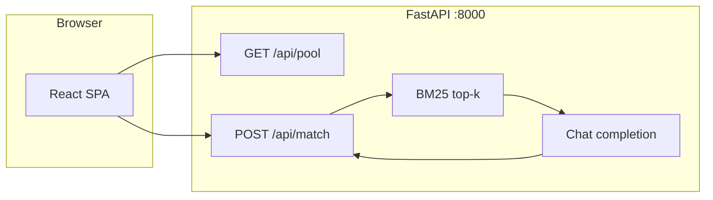

# Ditto AI

Demo “one thoughtful match” web app: a **React + Vite** frontend talks to a **FastAPI** backend that **BM25-retrieves** a small slice of a fixed profile pool, then asks an **LLM** (Cerebras or OpenAI-compatible) to pick one person and write the pitch. No separate `/docs` site; this file plus the in-app **About** page (`/about`) are the overview.

## What it is (30 seconds)

- **Data**: Synthetic JSON profiles (`backend/app/data/*.json`). Portrait URLs are stock-style (e.g. Pexels); **no real users, no PII, not a production dating product.**
- **Flow**: User picks pool + age range → browses grid → writes a short “vibe” → **POST `/api/match`** returns a single `Person` plus LLM-written **reason**, **date_plan**, **location**, and **suggested_time**.
- **Without an API key**: the backend still returns a **fallback** match (first retrieved profile + canned copy) so the UI works for local demos.



## Run locally

**Backend** (Python 3.11+ recommended):

```bash
cd backend
python -m venv .venv && source .venv/bin/activate   # Windows: .venv\Scripts\activate
pip install -r requirements.txt
cp .env.example .env   # add at least one LLM key if you want real inference
uvicorn app.main:app --reload --host 0.0.0.0 --port 8000
```

**Frontend** (Node 18+):

```bash
cd frontend
npm install
npm run dev
```

Open the URL Vite prints (default **http://localhost:5173**). The dev server **proxies** `/api` and `/health` to `http://127.0.0.1:8000` (see `frontend/vite.config.ts`).

## Environment variables

Copy `backend/.env.example` → `backend/.env`. Pydantic loads from the process env; names are **UPPER_SNAKE** matching the fields in `backend/app/config.py`.

| Variable | Purpose |
|----------|---------|
| `CEREBRAS_API_KEY` | **Preferred** if set. OpenAI-compatible Cerebras Inference (`CEREBRAS_BASE_URL`, `CEREBRAS_MODEL`). |
| `OPENAI_API_KEY` | Used when Cerebras is unset. `OPENAI_BASE_URL` (default `https://api.openai.com/v1`), `OPENAI_MODEL` (default `gpt-4o-mini`). |
| `CORS_ORIGINS` | Comma-separated browser origins (default includes `http://localhost:5173`). |
| `RAG_TOP_K` | Max profiles passed to the LLM after BM25 (default `12`). |
| `PEXELS_API_KEY` | Optional; only for `scripts/fetch_pexels_pool_images.py`. |
| `SIMULATE_LLM_RATE_LIMIT` | `true` forces the rate-limit error path without calling the API (dev). |

## Tests

```bash
cd backend
pytest
```

Example: BM25 ordering is covered in `backend/tests/test_rag.py`.

Frontend:

```bash
cd frontend
npm run lint
npm run build
```

## Known demo limits

- **`/api/match` spends LLM credits** when a key is configured: there is **no auth**, **no per-IP rate limit**, and **`user_bio` has no max length** in the schema. Treat this as a **local / trusted demo**, not a public production API.
- **Error responses**: Rate limits and upstream failures return user-oriented messages; **generic `500` responses may still include `str(exception)`** — fine for debugging, noisy if you expose the API publicly.
- **UI vs API**: The celebration modal surfaces **name, image, and reason**; the JSON also includes **date_plan**, **location**, and **suggested_time** (visible in network tab or API clients).
- **Deploy**: No Dockerfile or platform config in-repo; run the two processes (or build `frontend` to static files and serve behind any reverse proxy) as you prefer.

## Security / data posture (one line)

**All profiles are fictional; images are stock/synthetic sources. No real user data is collected or stored by this demo.**
